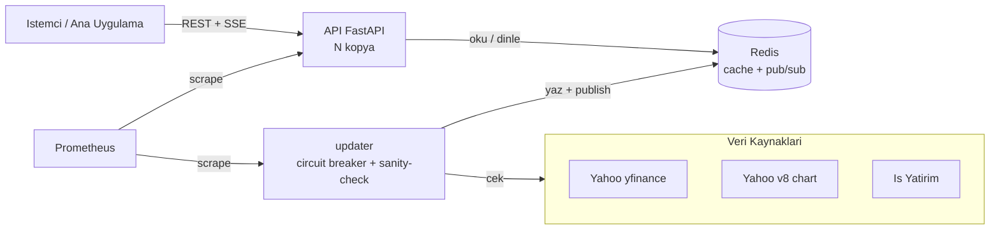

# 📈 BIST Data Service

[](https://github.com/Armert-Labs/bist-data-service/actions/workflows/ci.yml)
[](LICENSE)
[](https://www.python.org)
[](https://github.com/astral-sh/ruff)
[](docker-compose.yml)

> BIST (Borsa İstanbul) hisseleri için **~15 dk gecikmeli**, halka açık fiyat verisini
> toplayan; Redis'te önbellekleyen; **REST + SSE + Prometheus** ile sunan üretim sınıfı
> bir veri kaynağı mikroservisi. Login/oturum gerektirmez.

Kaynaklar: **Yahoo Finance** (yfinance + v8 chart) + **İş Yatırım** (bağımsız fallback).

---

## ✨ Özellikler

- 🔌 **Tek uç noktadan tüm BIST** — `GET /all` ile ~500+ hissenin anlık fiyatı
- 🔁 **Üç katmanlı fallback** — Yahoo → Yahoo chart → İş Yatırım + circuit breaker
- 📡 **Canlı akış** — Redis pub/sub tabanlı SSE fan-out (`/stream`)
- ✅ **Fiyat doğrulama** — çapraz-kaynak karşılaştırma + sapma metriği (`/validate`)
- 🔐 **Kimlik doğrulama** — çoklu API key, timing-safe, SHA-256 hash saklama
- 🛡️ **Dayanıklılık** — sanity-check, staleness tespiti, rate limit, bounded fetch
- 📊 **Gözlemlenebilirlik** — Prometheus `/metrics`, JSON log, `/health` + `/ready`
- 🐳 **Üretime hazır** — Docker Compose, multi-stage imaj, non-root, CI/CD

## 🏗️ Mimari



- **updater** — tek yazıcı; batch çeker, doğrular, Redis'e yazar, pub/sub yayınlar
- **api** — stateless, N kopyaya ölçeklenir; Redis'ten okur, SSE'yi pub/sub ile besler
- **Redis yoksa** — updater API içinde çalışır (tek instance, in-memory); `REDIS_URL` boş bırakın

---

## ⚠️ Yasal Not

Borsa İstanbul ücretsiz gerçek zamanlı API sunmaz. Bu servis bilinçli olarak
**gecikmeli + ücretsiz + login'siz** yolu seçer. Gerçek zamanlı/ticari dağıtım
**BIST lisansı** gerektirir. Yalnızca kişisel/iç kullanım içindir.

## 🚀 Hızlı Başlangıç

### Docker Compose (önerilen)

```bash
git clone https://github.com/Armert-Labs/bist-data-service.git
cd bist-data-service
cp .env.example .env          # anahtarları/ayarları düzenleyin
docker compose up -d --build
```
API `:8000` → Dokümanlar `/docs` · Demo `/demo` · Sağlık `/health`

### Yerel (Redis'siz, geliştirme)

```bash
python -m venv .venv && source .venv/bin/activate
pip install -e ".[dev]"
make run        # uvicorn app.main:app --reload
```

## 🔗 Uç Noktalar

| Yöntem | Yol | Açıklama | Auth |
|---|---|---|:--:|
| GET | **`/all`** | Tüm BIST anlık fiyatları (`sort`, `order`) | 🔑 |
| GET | `/quote/{symbol}` | Tek hisse | 🔑 |
| GET | `/quotes?symbols=` | Çoklu / tümü | 🔑 |
| GET | `/history/{symbol}` | Geçmiş OHLCV | 🔑 |
| GET | `/intraday/{symbol}` | Gün-içi snapshot'lar | 🔑 |
| GET | `/validate` | Çapraz-kaynak fiyat doğrulama | 🔑 |
| GET | `/stream?symbols=` | SSE canlı akış | 🔑 |
| GET | `/symbols` | Takip listesi | 🔑 |
| GET | `/health` · `/ready` | Liveness · Readiness | — |
| GET | `/metrics` | Prometheus | 🔑* |

`*` `METRICS_PUBLIC=true` ise açık. `🔑` = `API_KEYS` tanımlıysa `X-API-Key` gerekir.

```bash
curl -H "X-API-Key: <anahtar>" http://localhost:8000/all
curl -H "X-API-Key: <anahtar>" "http://localhost:8000/all?sort=change_percent&order=desc"
```

## 🔌 Entegrasyon Rehberi

Bu bölüm, başka bir projeyi (mobil uygulama, backend, dashboard, bot vb.) bu
mikroservise **adım adım** bağlar. Tüm örnekler gerçek istek/yanıtlardır; örnek
veriler piyasa **kapalıyken** (son kapanış) alınmıştır. Uç nokta özeti için
yukarıdaki [🔗 Uç Noktalar](#-uç-noktalar) tablosuna bakın.

### 📶 Üç kanal özeti

Servis veriyi üç farklı şekilde sunar; ihtiyacınıza göre birini veya birkaçını kullanın:

| Kanal | Tip | Ne zaman kullanılır | Protokol |
|---|---|---|---|
| **REST** (`/quote`, `/quotes`, `/all`, `/history`, `/intraday`) | **Pull** — anlık + geçmiş | İhtiyaç anında tek seferlik sorgu, periyodik yoklama | HTTP GET → JSON |
| **`/stream`** | **Push** — canlı akış | Sürekli güncel fiyat isteyen dashboard/ticker | **SSE (Server-Sent Events)** |
| **Webhook** | **Push** — olay bazlı alarm | Fiyat bir eşiği/koşulu tetiklediğinde bildirim | HTTPS POST → JSON |

> ⚠️ **Canlı akış WebSocket DEĞİL, SSE'dir.** `/stream` tek yönlü (sunucu→istemci)
> `text/event-stream` yayınıdır. Tarayıcıda `EventSource`, sunucu tarafında
> fetch-stream / SSE client ile tüketilir. WS handshake beklemeyin.

### 🔑 Bağlanırken kimlik doğrulama

En az bir anahtar tanımlıysa veri uçları `X-API-Key` ister (`AUTH_REQUIRED`
değerinden bağımsız); her istekte bu başlığı gönderin. `AUTH_REQUIRED=true` iken
_hiç anahtar tanımlı değilse_ veri uçları `503` döner (fail-safe: yanlışlıkla
auth'suz açık kalmayı önler). `/health` ve `/ready` her zaman açıktır.

```bash
curl -H "X-API-Key: <anahtar>" http://localhost:8000/quote/THYAO
```

- **`/health` ve `/ready` her zaman açıktır** (probe için); bunlar anahtar istemez.
- Anahtar **eksik/yanlış** → `401 Unauthorized`.
- `AUTH_REQUIRED=true` ama **hiç anahtar tanımlı değilse** fail-safe devreye girer,
  veri uçları `503` döner (yanlışlıkla korumasız açılmayı engeller).
- **SSE ve tarayıcı uyarısı:** Tarayıcı `EventSource` özel başlık **gönderemez**.
  Auth açıkken `/stream`'i **sunucu tarafından** (fetch-stream / `sseclient`,
  `X-API-Key` ile) tüketin. Detay için [SSE bölümüne](#-sse--canlı-akış) bakın.

### 💹 REST — Anlık fiyat

#### `GET /quote/{symbol}` — tek hisse

```bash
curl -H "X-API-Key: <anahtar>" http://localhost:8000/quote/THYAO
```

```json
{
  "symbol": "THYAO",
  "price": 348.25,
  "previous_close": 328.5,
  "change": 19.75,
  "change_percent": 6.01,
  "open": null,
  "day_high": 355.5,
  "day_low": 345.25,
  "volume": 60645389,
  "currency": "TRY",
  "market_state": "CLOSED",
  "source": "yahoo_chart",
  "delayed": true,
  "updated_at": "2026-07-08T05:32:28.389121Z",
  "exchange_time": "2026-07-07T15:09:55Z"
}
```

Alanların anlamı için [Yanıt alan referansı](#-yanıt-alan-referansı).

#### `GET /quotes?symbols=` — çoklu hisse

Virgülle ayrılmış liste verin; boş bırakırsanız tüm takip listesi döner.
Bulunamayan semboller `missing` dizisinde raporlanır (404 **değil**).

```bash
curl -H "X-API-Key: <anahtar>" "http://localhost:8000/quotes?symbols=THYAO,YOKSYM"
```

```json
{
  "count": 1,
  "market": "CLOSED",
  "missing": ["YOKSYM"],
  "quotes": {
    "THYAO": { "symbol": "THYAO", "price": 348.25, "change_percent": 6.01, "...": "…tam Quote alanları" }
  }
}
```

#### `GET /all` — tüm BIST + sıralama, ETag, gzip

`sort=symbol|price|change|change_percent|volume` ve `order=asc|desc` ile sıralanır.
Yanıt bir **zarf** (envelope) içinde gelir; her hisse `quotes` dizisindedir.

```bash
curl -H "X-API-Key: <anahtar>" \
  "http://localhost:8000/all?sort=change_percent&order=desc"
```

```json
{
  "market": "CLOSED",
  "count": 616,
  "last_update": "2026-07-08T05:32:30.622217+00:00",
  "is_stale": false,
  "delayed": true,
  "quotes": [
    { "symbol": "THYAO", "price": 348.25, "change_percent": 6.01, "...": "…" }
  ]
}
```

**Bant genişliği tasarrufu — ETag / 304 ve gzip:** `/all` yanıtı bir `ETag`
döndürür. Değişmediyse `If-None-Match` ile `304 Not Modified` (boş gövde) alırsınız.
`Accept-Encoding: gzip` ile gövde sıkıştırılır.

```bash
# 1) İlk istek: ETag başlığını al (gzip ile)
curl -sD- -o /dev/null -H "X-API-Key: <anahtar>" -H "Accept-Encoding: gzip" \
  "http://localhost:8000/all?sort=change_percent&order=desc"
# ... yanıt başlıkları:  ETag: W/"76b3bc0f454e53b3"   Content-Encoding: gzip

# 2) Sonraki istek: veri değişmediyse 304 (gövde boş → veri tekrar indirilmez)
curl -sD- -o /dev/null -H "X-API-Key: <anahtar>" \
  -H 'If-None-Match: W/"76b3bc0f454e53b3"' \
  "http://localhost:8000/all?sort=change_percent&order=desc"
# ... HTTP/1.1 304 Not Modified
```

#### `GET /symbols` — takip listesi

Servisin takip ettiği BIST sembol listesini döner (bir sorgudan önce geçerli
sembolleri öğrenmek için kullanışlıdır).

```bash
curl -H "X-API-Key: <anahtar>" http://localhost:8000/symbols
```

#### `GET /validate?symbols=` — çapraz-kaynak doğrulama (salt-okunur)

Fiyatı ikinci bir kaynakla karşılaştırıp sapmayı raporlar; veriyi değiştirmez.

```bash
curl -H "X-API-Key: <anahtar>" "http://localhost:8000/validate?symbols=THYAO,GARAN"
```

```json
{
  "checked": 2,
  "compared": true,
  "threshold_pct": 1.0,
  "reference_status": { "yahoo_chart": "ok", "isyatirim": "ok" },
  "max_deviation_pct": 0.0,
  "consistent": true,
  "comparisons": [
    {
      "symbol": "THYAO",
      "primary": 348.25,
      "primary_source": "yahoo_chart",
      "references": { "yahoo_chart": { "price": 348.25, "deviation_pct": 0.0, "ok": true } }
    }
  ]
}
```

#### `GET /ready` — hazırlık yoklaması (probe, auth'suz)

Hazırsa `200`, hazır değilse **aynı gövdeyle** `503` döner. Orchestrator/health-check
için idealdir (bkz. [Hata ve limitler](#-hata-ve-limitler)).

```bash
curl http://localhost:8000/ready
```

```json
{
  "ready": true,
  "store_ok": true,
  "quotes_cached": 616,
  "is_stale": false,
  "fresh_pct": 100.0,
  "last_update_age_seconds": 3.2,
  "oldest_quote_age_seconds": 15.3,
  "market_open": false,
  "providers": { "yahoo": "closed", "yahoo_chart": "closed", "tradingview": "closed", "isyatirim": "closed" }
}
```

> **Provider durumu ters okunur:** `"closed"` = circuit **kapalı** = **SAĞLIKLI**.
> `"open"` = circuit açık = kaynak geçici devre dışı. `"half_open"` = toparlanıyor.

#### `GET /health` — liveness (auth'suz)

```bash
curl http://localhost:8000/health
```

```json
{ "status": "ok", "version": "0.1.0" }
```

### 🕰️ REST — Geçmiş

#### `GET /history/{symbol}` — OHLCV barları

| Parametre | İzin verilen değerler |
|---|---|
| `period` | `1d` `5d` `1mo` `3mo` `6mo` `1y` `2y` `5y` `10y` `ytd` `max` |
| `interval` | `1m` `2m` `5m` `15m` `30m` `60m` `90m` `1h` `1d` `5d` `1wk` `1mo` `3mo` |

```bash
curl -H "X-API-Key: <anahtar>" \
  "http://localhost:8000/history/THYAO?period=5d&interval=1d"
```

```json
{
  "symbol": "THYAO",
  "period": "5d",
  "interval": "1d",
  "currency": "TRY",
  "bars": [
    { "time": "2026-07-07T00:00:00+03:00", "open": 346.0, "high": 355.5, "low": 345.25, "close": null, "volume": 60645389 }
  ]
}
```

> Devam eden/erken seansta `close` `null` olabilir (bar henüz kapanmadı).

#### `GET /intraday/{symbol}` — gün-içi noktalar

Servisin biriktirdiği gün-içi `(zaman, fiyat)` noktalarını döner (mini grafik/ticker için).

```bash
curl -H "X-API-Key: <anahtar>" http://localhost:8000/intraday/THYAO
```

```json
{
  "symbol": "THYAO",
  "count": 33,
  "points": [
    { "t": "2026-07-08T05:28:55.551047+00:00", "p": 348.25 }
  ]
}
```

### 📡 SSE — Canlı akış

`GET /stream` bir `text/event-stream` yayını açar. **Bağlanır bağlanmaz ilk olay
tam bir snapshot'tır** (o anki tüm fiyatlar); sonra store her güncellendiğinde yeni
olay gelir. `symbols=` ile filtrelenir (boş = tüm liste). Her ~15 sn'de bir `: ping`
keep-alive yorumu gönderilir.

**Olay formatı:**

```
event: quotes
data: {"market":"CLOSED","quotes":{"THYAO":{...Quote},"GARAN":{...Quote}}}

: ping - 2026-07-08T05:32:28Z
```

> `: ` ile başlayan satır SSE yorum satırıdır (keep-alive); istemci yok sayar.

#### (a) Tarayıcı — `EventSource`

```html
<script>
  // ⚠️ Tarayıcı EventSource ÖZEL BAŞLIK GÖNDEREMEZ.
  // Auth açıksa (AUTH_REQUIRED=true) bu yol çalışmaz; sunucu-taraf istemci kullanın.
  const es = new EventSource("http://localhost:8000/stream?symbols=THYAO,GARAN");
  es.addEventListener("quotes", (e) => {
    const data = JSON.parse(e.data);
    console.log(data.market, data.quotes.THYAO?.price);
  });
  es.onerror = (e) => console.warn("SSE hata / yeniden bağlanıyor", e);
</script>
```

#### (b) Python — `httpx` stream (X-API-Key ile)

```python
import json
import httpx

BASE, HEADERS = "http://localhost:8000", {"X-API-Key": "<anahtar>"}

with httpx.stream("GET", f"{BASE}/stream?symbols=THYAO,GARAN",
                  headers=HEADERS, timeout=None) as resp:
    resp.raise_for_status()
    event = None
    for line in resp.iter_lines():
        if line.startswith("event:"):
            event = line[6:].strip()
        elif line.startswith("data:"):
            payload = json.loads(line[5:].strip())
            print(event, payload["market"], list(payload["quotes"]))
```

> Alternatif: `sseclient` (btubbs) paketi ile `SSEClient(url, headers={"X-API-Key": "..."})`
> başlık destekler. (`sseclient-py`/mpetazzoni farklı bir imza kullanır; yukarıdaki
> httpx örneği en taşınabilir yoldur.)

#### (c) Node — `eventsource` (başlık destekli)

```js
// npm i eventsource  (yerleşik/ tarayıcı EventSource'un aksine başlık verilebilir)
import { EventSource } from "eventsource";

const es = new EventSource("http://localhost:8000/stream?symbols=THYAO,GARAN", {
  fetch: (url, init) =>
    fetch(url, { ...init, headers: { ...init.headers, "X-API-Key": "<anahtar>" } }),
});

es.addEventListener("quotes", (e) => {
  const data = JSON.parse(e.data);
  console.log(data.market, Object.keys(data.quotes));
});
```

### 🔔 Webhook — Olay bazlı push

Fiyat bir koşulu tetiklediğinde servis, tanımladığınız URL'e JSON `POST` eder.
`WEBHOOKS_ENABLED=true` ve `WEBHOOKS_CONFIG` ile kural dosyası verilerek açılır.

**`webhooks.json` kural şeması:**

```json
{
  "rules": [
    {
      "id": "thyao-ust-350",
      "symbol": "THYAO",
      "condition": "above",
      "threshold": 350,
      "url": "https://ornek.com/webhook",
      "cooldown": 300
    }
  ]
}
```

| Alan | Anlamı |
|---|---|
| `id` | Kural kimliği (payload'da `rule_id` olarak döner) |
| `symbol` | İzlenecek BIST sembolü |
| `condition` | `above` (fiyat eşiğin üstüne çıkınca) · `below` (altına inince) · `pct_up` (yüzde değişim eşiği yukarı) · `pct_down` (yüzde değişim eşiği aşağı) |
| `threshold` | Eşik değeri (fiyat veya yüzde) |
| `url` | Hedef — **HTTPS zorunlu** (SSRF koruması) |
| `cooldown` | Aynı kural için tekrar tetiklenmeden önce beklenecek sn (varsayılan `300`) |

**Tetiklenince hedefe `POST` edilen gerçek payload:**

```json
{
  "rule_id": "thyao-ust-300",
  "symbol": "THYAO",
  "condition": "above",
  "threshold": 300.0,
  "price": 348.25,
  "change_percent": 6.01,
  "triggered_at": "2026-07-08T05:35:21.811634+00:00"
}
```

> **Güvenlik:** `url` **HTTPS** olmalıdır; opsiyonel `WEBHOOK_URL_ALLOWLIST` ile
> hedef hostname'leri kısıtlayın. İmza (HMAC) **yoktur**, düz JSON POST'tur —
> alıcıyı tahmin edilemez bir path/secret ile koruyun. Teslimat non-blocking'tir;
> hata olursa `webhook_max_retries` kez backoff ile yeniden denenir.

**Ortam değişkenleri:**

```
WEBHOOKS_ENABLED=true
WEBHOOKS_CONFIG=/app/webhooks.json
WEBHOOK_URL_ALLOWLIST=ornek.com     # opsiyonel; virgülle çoklu hostname
```

**Alıcı (receiver) örneği — Python (FastAPI):**

```python
from fastapi import FastAPI, Request

app = FastAPI()

@app.post("/webhook")
async def receive(req: Request):
    e = await req.json()
    print(e["rule_id"], e["symbol"], e["price"], e["condition"], e["threshold"])
    return {"ok": True}
```

**Alıcı örneği — Node (Express):**

```js
import express from "express";
const app = express();
app.use(express.json());
app.post("/webhook", (req, res) => {
  const e = req.body;
  console.log(e.rule_id, e.symbol, e.price, e.condition, e.threshold);
  res.json({ ok: true });
});
app.listen(9000);
```

### 🧩 İstemci kod örnekleri — "diğer projeye bağlanma"

#### Python (`requests` periyodik çekim + `httpx` SSE)

```python
import requests

BASE, HEADERS = "http://localhost:8000", {"X-API-Key": "<anahtar>"}

# Periyodik anlık fiyat
r = requests.get(f"{BASE}/quote/THYAO", headers=HEADERS, timeout=10)
r.raise_for_status()
q = r.json()
print(q["symbol"], q["price"], q["change_percent"])

# Toplu çekim
allq = requests.get(f"{BASE}/all?sort=change_percent&order=desc",
                    headers=HEADERS, timeout=15).json()
print(allq["count"], "hisse,", "bayat" if allq["is_stale"] else "taze")
```

Canlı akış için yukarıdaki [SSE — Python örneğine](#b-python--httpx-stream-x-api-key-ile) bakın.

#### Node / JS (`fetch` + `EventSource`)

```js
const BASE = "http://localhost:8000";
const H = { "X-API-Key": "<anahtar>" };

// Periyodik anlık fiyat
const res = await fetch(`${BASE}/quote/THYAO`, { headers: H });
if (!res.ok) throw new Error(`HTTP ${res.status}`);
const q = await res.json();
console.log(q.symbol, q.price, q.change_percent);
```

Canlı akış için [SSE — Node örneğine](#c-node--eventsource-başlık-destekli) bakın.

#### curl (hızlı test)

```bash
curl -H "X-API-Key: <anahtar>" http://localhost:8000/quote/THYAO
curl -H "X-API-Key: <anahtar>" "http://localhost:8000/quotes?symbols=THYAO,GARAN"
curl -N -H "X-API-Key: <anahtar>" "http://localhost:8000/stream?symbols=THYAO"   # SSE (-N: buffersız)
```

### 📖 Yanıt alan referansı

Quote nesnesindeki alanlar (`/quote`, `/quotes`, `/all`, `/stream` içinde aynıdır):

| Alan | Tip | Anlamı |
|---|---|---|
| `symbol` | string | BIST sembolü (örn. `THYAO`) |
| `price` | number | Son fiyat (**~15 dk gecikmeli**) |
| `previous_close` | number | Önceki seans kapanışı |
| `change` | number | Fiyat değişimi (mutlak, TRY) |
| `change_percent` | number | Yüzde değişim |
| `open` | number \| null | Açılış (kaynak sağlamazsa `null`) |
| `day_high` / `day_low` | number | Gün-içi en yüksek / en düşük |
| `volume` | number | İşlem hacmi (adet) |
| `currency` | string | Her zaman `"TRY"` |
| `market_state` | enum | `OPEN` \| `CLOSED` \| `UNKNOWN` — seans durumu |
| `source` | string | Fiyatı sağlayan kaynak (`yahoo_chart`, `isyatirim`, …) |
| `delayed` | bool | BIST için **her zaman `true`** (gerçek-zamanlı değil) |
| `updated_at` | ISO-8601 UTC | Servisin cache'e **yazım anı** (veri tazeliği bununla ölçülür) |
| `exchange_time` | ISO-8601 UTC \| null | Borsadaki **gerçek işlem zamanı** (kaynak sağlarsa) |

Zarf (envelope) düzeyi alanlar (`/all`, `/quotes`, `/stream`): `market`, `count`,
`last_update`, `is_stale` (veri bayat mı), `delayed`, ve `/quotes`'ta `missing`.

> **Gecikme & seans:** Veri **~15 dk gecikmelidir** (`delayed: true`). BIST seansı
> **10:00–18:15** (Europe/Istanbul, UTC+3). Piyasa kapalıyken (`market_state: "CLOSED"`)
> değerler **son kapanışı** yansıtır ve bu durumda **bayatlamaz** (`is_stale: false`) —
> yani kapalı piyasada eski görünen `exchange_time` normaldir.

### ⚠️ Hata ve limitler

| Kod | Anlam | Ne yapmalı |
|---|---|---|
| `400` | Geçersiz parametre (bilinmeyen `period`/`interval`/`sort` vb.) | İstek parametrelerini düzeltin |
| `401` | `X-API-Key` eksik/yanlış | Doğru anahtarı `X-API-Key` başlığıyla gönderin |
| `404` | Sembol/kaynak bulunamadı | Sembolü `/symbols` veya `/validate` ile doğrulayın (çoklu sorguda `/quotes` bunu `missing`'e koyar) |
| `429` | Rate limit aşıldı | `Retry-After` başlığı kadar bekleyin; limit `X-RateLimit-Limit`'te (varsayılan `120/minute`) |
| `503` | Servis hazır değil / fail-safe auth (anahtarsız `AUTH_REQUIRED`) | `/ready` ile hazırlığı yoklayıp tekrar deneyin |

**Hazırlık yoklama (orchestrator / health-check önerisi):**

```bash
# 200 → hazır; 503 → henüz değil (aynı gövde döner). Deploy/başlangıçta bunu bekleyin.
until curl -fsS http://localhost:8000/ready >/dev/null; do sleep 2; done
```

- **Liveness** için `/health`, **readiness** için `/ready` kullanın (ikisi de auth'suz).
- `429` alırsanız `Retry-After`'a uyun; sabit hızlı yoklama yerine exponential backoff önerilir.
- Servis geçici `503` verse bile REST/SSE istemcinizi otomatik yeniden denemeye ayarlayın.

## 🔐 Kimlik Doğrulama

```bash
# Anahtar üret
python -c "import secrets; print(secrets.token_urlsafe(32))"
```
`.env` içinde:
```
API_KEYS=<anahtar>:mobil,<anahtar2>:web   # coklu, etiketli
AUTH_REQUIRED=true                         # anahtar yoksa 503 (fail-safe)
METRICS_PUBLIC=false                       # /metrics de auth ister
```
Üretimde plaintext yerine `API_KEYS_SHA256` ile hash saklayabilirsiniz.

## 📊 Gözlemlenebilirlik

- API metrikleri: `:8000/metrics` · Updater iş metrikleri: `:8001/metrics`
- Örnek Prometheus + Grafana yapılandırması: [`deploy/`](deploy/)
- Yapısal JSON log + her isteğe `X-Request-ID`

## 🧪 Geliştirme

```bash
make install     # bağımlılıklar + pre-commit
make lint        # ruff
make typecheck   # mypy
make test        # pytest
make cov         # pytest + kapsam
```
Ayrıntılar için [CONTRIBUTING.md](CONTRIBUTING.md).

## ⚙️ Yapılandırma (öne çıkanlar)

| Değişken | Varsayılan | Açıklama |
|---|---|---|
| `REDIS_URL` | *(boş)* | Boş = in-memory. Compose: `redis://redis:6379/0` |
| `PROVIDERS` | `yahoo,yahoo_chart,isyatirim` | Kaynak fallback zinciri |
| `PROVIDER_MODE` | `failover` | `failover` \| `gapfill` |
| `UPDATE_INTERVAL` | `60` | Güncelleme aralığı (sn) |
| `STALENESS_SECONDS` | `300` | Bayatlık eşiği (`/ready`) |
| `RATE_LIMIT` | `120/minute` | IP başına limit |

Tam liste: [`.env.example`](.env.example)

## 📈 Ölçekleme

- `api`'yi çok kopyaya ölçekle (stateless); `updater` **tek** olmalı.
- Redis Pub/Sub, SSE fan-out'u tüm kopyalara dağıtır.
- K8s: `/health` → liveness, `/ready` → readiness probe.

## 🤝 Katkı & Lisans

Katkılar için [CONTRIBUTING.md](CONTRIBUTING.md) · Güvenlik: [SECURITY.md](SECURITY.md)
· Davranış: [CODE_OF_CONDUCT.md](CODE_OF_CONDUCT.md)

[MIT Lisansı](LICENSE) © 2026 Armert Labs
