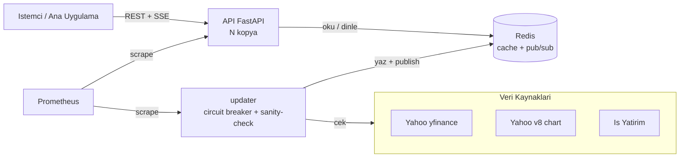

# 📈 BIST Data Service

[](https://github.com/Armert-Labs/bist-data-service/actions/workflows/ci.yml)
[](LICENSE)
[](https://www.python.org)
[](https://github.com/astral-sh/ruff)
[](docker-compose.yml)

> BIST (Borsa İstanbul) hisseleri için **~15 dk gecikmeli**, halka açık fiyat verisini
> toplayan; Redis'te önbellekleyen; **REST + SSE + Prometheus** ile sunan üretim sınıfı
> bir veri kaynağı mikroservisi. Login/oturum gerektirmez.

Kaynaklar: **Yahoo Finance** (yfinance + v8 chart) + **İş Yatırım** (bağımsız fallback).

---

## ✨ Özellikler

- 🔌 **Tek uç noktadan tüm BIST** — `GET /all` ile ~500+ hissenin anlık fiyatı
- 🔁 **Üç katmanlı fallback** — Yahoo → Yahoo chart → İş Yatırım + circuit breaker
- 📡 **Canlı akış** — Redis pub/sub tabanlı SSE fan-out (`/stream`)
- ✅ **Fiyat doğrulama** — çapraz-kaynak karşılaştırma + sapma metriği (`/validate`)
- 🔐 **Kimlik doğrulama** — çoklu API key, timing-safe, SHA-256 hash saklama
- 🛡️ **Dayanıklılık** — sanity-check, staleness tespiti, rate limit, bounded fetch
- 📊 **Gözlemlenebilirlik** — Prometheus `/metrics`, JSON log, `/health` + `/ready`
- 🐳 **Üretime hazır** — Docker Compose, multi-stage imaj, non-root, CI/CD

## 🏗️ Mimari



- **updater** — tek yazıcı; batch çeker, doğrular, Redis'e yazar, pub/sub yayınlar
- **api** — stateless, N kopyaya ölçeklenir; Redis'ten okur, SSE'yi pub/sub ile besler
- **Redis yoksa** — updater API içinde çalışır (tek instance, in-memory); `REDIS_URL` boş bırakın

---

## ⚠️ Yasal Not

Borsa İstanbul ücretsiz gerçek zamanlı API sunmaz. Bu servis bilinçli olarak
**gecikmeli + ücretsiz + login'siz** yolu seçer. Gerçek zamanlı/ticari dağıtım
**BIST lisansı** gerektirir. Yalnızca kişisel/iç kullanım içindir.

## 🚀 Hızlı Başlangıç

### Docker Compose (önerilen)

```bash
git clone https://github.com/Armert-Labs/bist-data-service.git
cd bist-data-service
cp .env.example .env          # anahtarları/ayarları düzenleyin
docker compose up -d --build
```
API `:8000` → Dokümanlar `/docs` · Demo `/demo` · Sağlık `/health`

### Yerel (Redis'siz, geliştirme)

```bash
python -m venv .venv && source .venv/bin/activate
pip install -e ".[dev]"
make run        # uvicorn app.main:app --reload
```

## 🔗 Uç Noktalar

| Yöntem | Yol | Açıklama | Auth |
|---|---|---|:--:|
| GET | **`/all`** | Tüm BIST anlık fiyatları (`sort`, `order`) | 🔑 |
| GET | `/quote/{symbol}` | Tek hisse | 🔑 |
| GET | `/quotes?symbols=` | Çoklu / tümü | 🔑 |
| GET | `/history/{symbol}` | Geçmiş OHLCV | 🔑 |
| GET | `/intraday/{symbol}` | Gün-içi snapshot'lar | 🔑 |
| GET | `/validate` | Çapraz-kaynak fiyat doğrulama | 🔑 |
| GET | `/stream?symbols=` | SSE canlı akış | 🔑 |
| GET | `/symbols` | Takip listesi | 🔑 |
| GET | `/health` · `/ready` | Liveness · Readiness | — |
| GET | `/metrics` | Prometheus | 🔑* |

`*` `METRICS_PUBLIC=true` ise açık. `🔑` = `API_KEYS` tanımlıysa `X-API-Key` gerekir.

```bash
curl -H "X-API-Key: <anahtar>" http://localhost:8000/all
curl -H "X-API-Key: <anahtar>" "http://localhost:8000/all?sort=change_percent&order=desc"
```

## 🔐 Kimlik Doğrulama

```bash
# Anahtar üret
python -c "import secrets; print(secrets.token_urlsafe(32))"
```
`.env` içinde:
```
API_KEYS=<anahtar>:mobil,<anahtar2>:web   # coklu, etiketli
AUTH_REQUIRED=true                         # anahtar yoksa 503 (fail-safe)
METRICS_PUBLIC=false                       # /metrics de auth ister
```
Üretimde plaintext yerine `API_KEYS_SHA256` ile hash saklayabilirsiniz.

## 📊 Gözlemlenebilirlik

- API metrikleri: `:8000/metrics` · Updater iş metrikleri: `:8001/metrics`
- Örnek Prometheus + Grafana yapılandırması: [`deploy/`](deploy/)
- Yapısal JSON log + her isteğe `X-Request-ID`

## 🧪 Geliştirme

```bash
make install     # bağımlılıklar + pre-commit
make lint        # ruff
make typecheck   # mypy
make test        # pytest
make cov         # pytest + kapsam
```
Ayrıntılar için [CONTRIBUTING.md](CONTRIBUTING.md).

## ⚙️ Yapılandırma (öne çıkanlar)

| Değişken | Varsayılan | Açıklama |
|---|---|---|
| `REDIS_URL` | *(boş)* | Boş = in-memory. Compose: `redis://redis:6379/0` |
| `PROVIDERS` | `yahoo,yahoo_chart,isyatirim` | Kaynak fallback zinciri |
| `PROVIDER_MODE` | `failover` | `failover` \| `gapfill` |
| `UPDATE_INTERVAL` | `60` | Güncelleme aralığı (sn) |
| `STALENESS_SECONDS` | `300` | Bayatlık eşiği (`/ready`) |
| `RATE_LIMIT` | `120/minute` | IP başına limit |

Tam liste: [`.env.example`](.env.example)

## 📈 Ölçekleme

- `api`'yi çok kopyaya ölçekle (stateless); `updater` **tek** olmalı.
- Redis Pub/Sub, SSE fan-out'u tüm kopyalara dağıtır.
- K8s: `/health` → liveness, `/ready` → readiness probe.

## 🤝 Katkı & Lisans

Katkılar için [CONTRIBUTING.md](CONTRIBUTING.md) · Güvenlik: [SECURITY.md](SECURITY.md)
· Davranış: [CODE_OF_CONDUCT.md](CODE_OF_CONDUCT.md)

[MIT Lisansı](LICENSE) © 2026 Armert Labs
